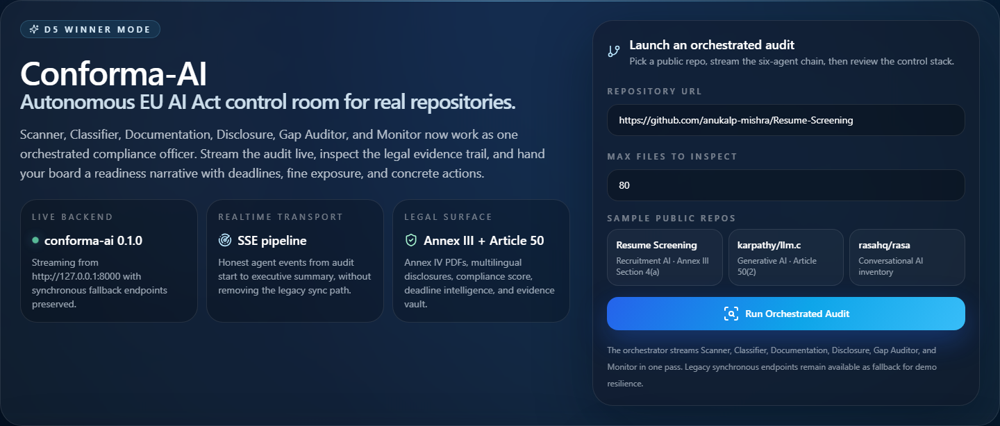
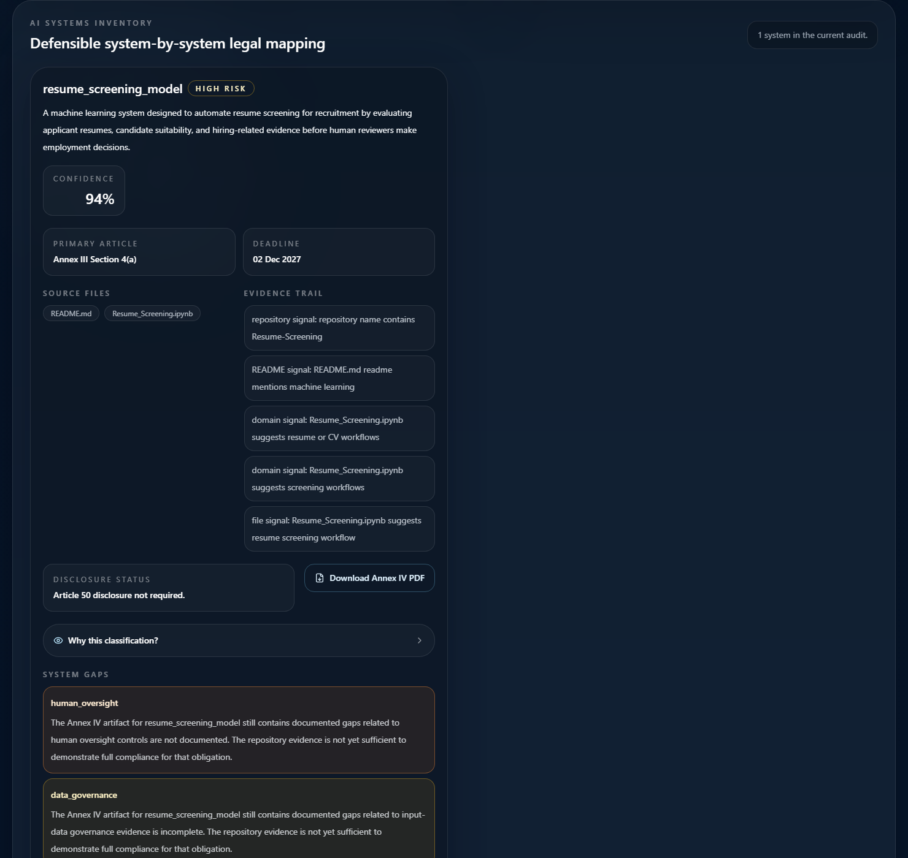
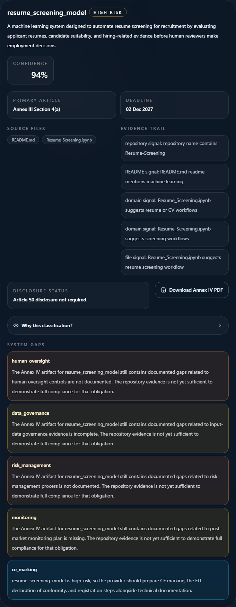
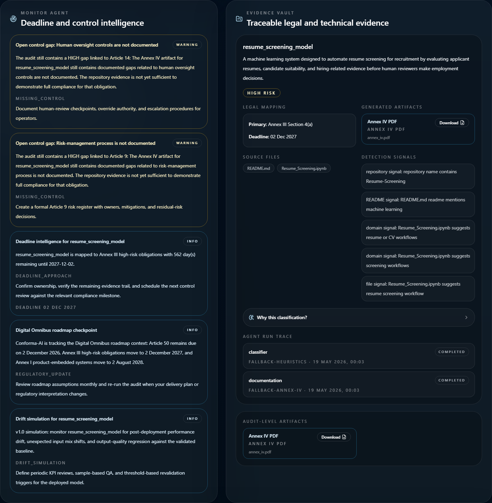
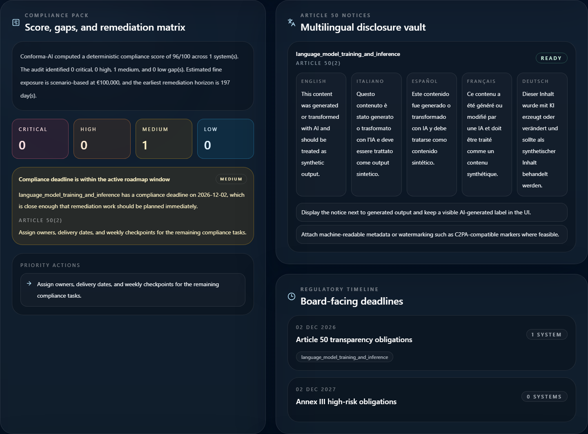
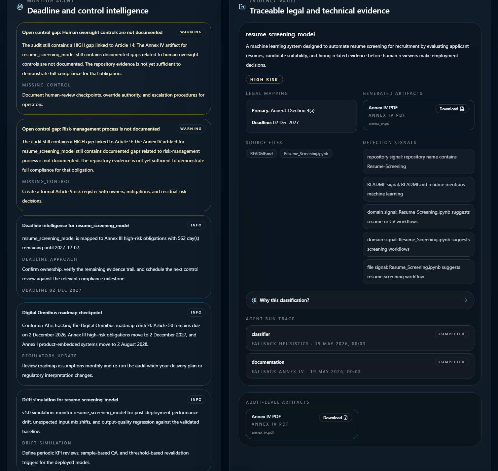
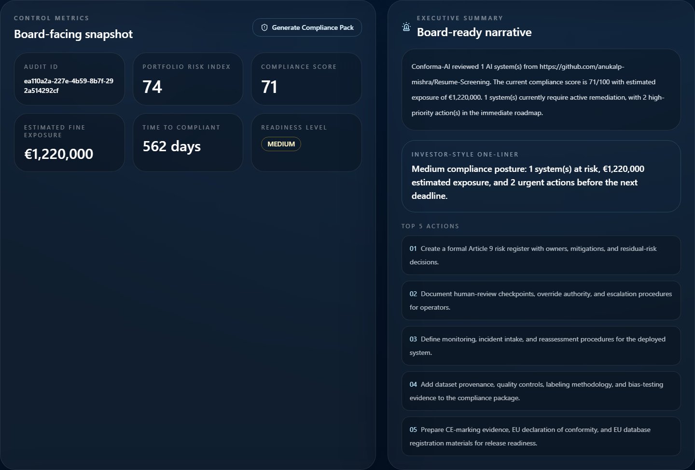
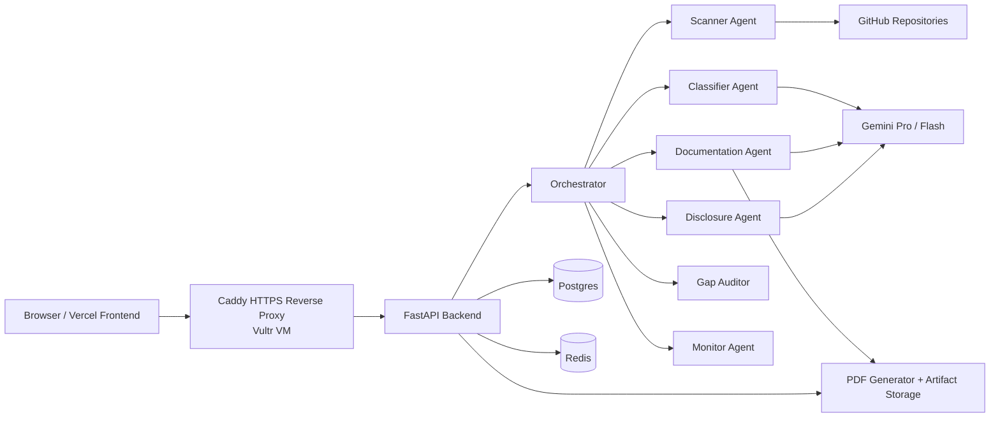
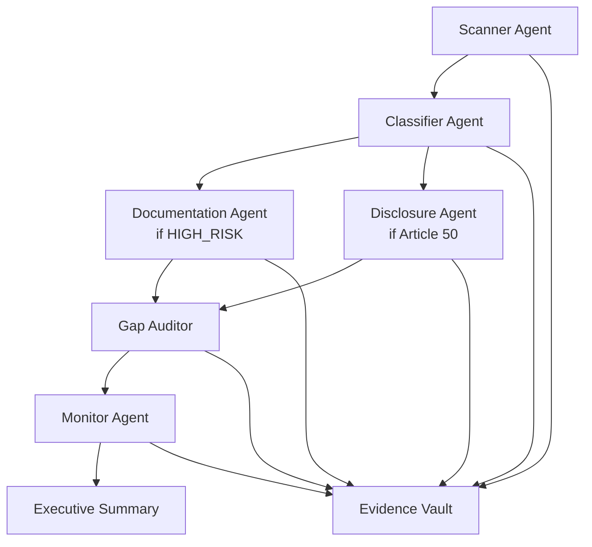
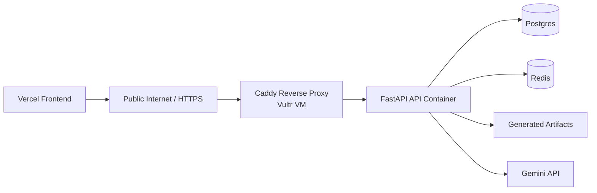

# Conforma-AI

**Autonomous EU AI Act Compliance Officer for Real AI Codebases**

Conforma-AI scans real software repositories, detects AI systems, classifies EU AI Act risk, generates Annex IV documentation, creates Article 50 disclosures, computes compliance posture, monitors deadlines, and gives executives a board-ready remediation plan.




## The problem

Enterprises are shipping AI faster than governance teams can inventory it.

The real risk is rarely in a policy PDF. It lives inside repositories, notebooks, hidden model logic, prompts, dependencies, product workflows, and undocumented decision paths. Legal teams cannot manually inspect every codebase. Engineering teams often do not know which EU AI Act obligations apply. Compliance teams need defensible evidence, not vibes.

That creates an operational gap:

- AI systems can be deployed before they are formally inventoried.
- High-risk triggers can hide in code, notebooks, README files, and model pipelines.
- Annex IV documentation is slow, expensive, and often written after the fact.
- Article 50 disclosures are easy to miss in product flows.
- Manual readiness reviews can take weeks per system.
- Missing evidence around human oversight, data governance, testing, monitoring, or transparency can create material regulatory and commercial risk.

Conforma-AI is built for that gap. It turns AI repositories into defensible compliance evidence.

## What Conforma-AI does

**Real repo in. Compliance control room out.**

- Detects AI systems inside GitHub repositories.
- Maps each system to EU AI Act risk categories.
- Generates Annex IV technical documentation for high-risk systems.
- Generates multilingual Article 50 disclosure notices for generative and user-facing systems.
- Computes compliance score, estimated fine exposure, and readiness level.
- Creates a prioritized remediation backlog.
- Monitors deadlines and open controls.
- Preserves source evidence and agent trace in an Evidence Vault.

From hidden AI risk to board-ready remediation in minutes.

## Product demo screenshots

**High-risk recruitment AI: Resume-Screening**



Resume-Screening is detected as a recruitment AI system, classified as **HIGH_RISK**, mapped to **Annex III Section 4(a)**, and surfaced with compliance posture, fine exposure, and readiness.

**Annex IV technical documentation artifact**



High-risk systems can generate a downloadable Annex IV PDF artifact directly from the control room.

**Evidence Vault**



Every classification is backed by source files, detection signals, legal mapping, artifacts, and agent trace.

**Article 50 multilingual disclosures**



Generative and user-facing systems receive multilingual disclosure notices in **English, Italian, Spanish, French, and German**.

**Monitor Agent and regulatory deadlines**



The Monitor Agent converts obligations into deadline intelligence, missing-control alerts, and roadmap visibility.

**Executive Summary**



Compliance posture, business impact, top actions, and readiness are rendered in a board-ready narrative.

## Why this is different

Conforma-AI is not a chatbot. It is an autonomous compliance workflow engine.

| Approach | Manual process | Conforma-AI |
| --- | --- | --- |
| AI inventory | Repo review by humans | Repository scanner with evidence extraction |
| Legal triage | Ad hoc legal interpretation | Classifier with structured outputs and deterministic guardrails |
| Technical documentation | Manual drafting | Annex IV PDF generation |
| Transparency notices | Product-by-product writing | Multilingual Article 50 notice generation |
| Remediation | Spreadsheet chasing | Compliance score, gap matrix, and priority actions |
| Executive communication | Status decks assembled later | Board-ready summary generated from live evidence |

Why it matters:

- Multi-agent orchestration instead of isolated prompts
- Structured outputs instead of untraceable free text
- Deterministic legal guardrails instead of model-only guesses
- Real repository evidence instead of questionnaire theater
- Downloadable artifacts instead of “trust me” summaries
- SSE event stream instead of opaque waiting
- Enterprise control room instead of a demo chatbot shell

Not another policy document. A live control room for AI regulation.

## Architecture



### Technology stack

- **Backend:** Python, FastAPI, SQLAlchemy, Alembic, Postgres, Redis
- **Frontend:** Next.js, React, TypeScript, Tailwind CSS
- **AI layer:** Gemini Pro and Gemini Flash with deterministic fallback guardrails
- **Artifacts:** Annex IV PDF, Article 50 notice JSON
- **PDF generation:** WeasyPrint
- **Infrastructure:** Vultr, Docker Compose, Caddy, Vercel
- **Evidence extraction:** README files, notebooks, dependencies, model files, source code signals
- **Orchestration:** sequential but honest, streamed through backend SSE events

## Multi-agent workflow



### Scanner Agent

**Purpose**  
Clone public repositories, inspect likely AI-bearing files, and build an AI system inventory grounded in code and repo evidence.

**Input**  
Repo URL, scan limits, file filters.

**Output**  
Candidate AI systems with names, descriptions, source files, and detection signals.

**Why it matters**  
Most compliance programs fail before classification because they do not have a trustworthy AI inventory.

### Classifier Agent

**Purpose**  
Map detected systems to EU AI Act categories using Gemini plus deterministic legal guardrails.

**Input**  
System description, source files, repo evidence, detection signals.

**Output**  
Risk class, legal trigger, reasoning, deadline, confidence, and Article 50 flag.

**Why it matters**  
This is the decision layer that turns raw repo evidence into obligations engineering and legal teams can act on.

### Documentation Agent

**Purpose**  
Generate Annex IV technical documentation for high-risk systems.

**Input**  
Audit ID, AI system ID, risk class, legal trigger, source evidence, metadata.

**Output**  
Structured Annex IV sections plus downloadable PDF artifact.

**Why it matters**  
High-risk AI without technical documentation is operationally exposed and commercially hard to defend.

### Disclosure Agent

**Purpose**  
Generate multilingual Article 50 transparency notices for systems that interact with users or create synthetic output.

**Input**  
Audit system metadata plus Article 50 trigger.

**Output**  
Notices in EN, IT, ES, FR, and DE with placement guidance.

**Why it matters**  
Transparency obligations fail in product teams when they are not turned into real UI-ready content.

### Gap Auditor Agent

**Purpose**  
Convert raw findings into a compliance score, estimated exposure, remediation backlog, and priority actions.

**Input**  
Systems, artifacts, disclosures, and deterministic scoring rules.

**Output**  
Compliance score, gap severity matrix, fine exposure estimate, time-to-compliant, and actions.

**Why it matters**  
Executives do not fund vague legal concerns. They fund prioritized operational risk reduction.

### Monitor Agent

**Purpose**  
Track deadlines, open controls, roadmap assumptions, and post-audit monitoring posture.

**Input**  
Systems, gaps, deadlines, and artifacts.

**Output**  
Alerts, next check time, and regulatory timeline context.

**Why it matters**  
Compliance is not a one-time classification. It is a living operational obligation.

### Orchestrator

**Purpose**  
Run the full pipeline end-to-end and stream honest progress to the control room.

**Input**  
Repo audit request.

**Output**  
Scanner inventory, legal classification, artifacts, compliance pack, monitoring, executive summary, and evidence vault.

**Why it matters**  
The product feels like an autonomous compliance officer because the workflow is orchestrated, not stitched together manually.

## Evidence-first compliance model

Conforma-AI preserves the full chain of evidence behind each decision:

- source files
- detection signals
- legal mapping
- classifier reasoning
- generated artifacts
- gaps and remediations
- agent run trace

That makes the system explainable to compliance, legal, engineering, security, and executive stakeholders.


## Real demo cases

| Repo | Detected system | Classification | Legal trigger | Output |
| --- | --- | --- | --- | --- |
| `anukalp-mishra/Resume-Screening` | `resume_screening_model` | `HIGH_RISK` | `Annex III Section 4(a)` | Annex IV PDF + Compliance Pack + Evidence Vault |
| `karpathy/llm.c` | `language_model_training_and_inference` | `LIMITED_RISK` | `Article 50(2)` | Multilingual disclosure pack + Compliance Pack + Evidence Vault |
| `rasahq/rasa` | conversational AI inventory | limited-risk candidate analysis | Article 50 analysis | AI system inventory + legal triage |

## Business value

- Reduce manual AI governance triage from weeks to minutes.
- Create board-ready compliance narratives without separate reporting projects.
- Give legal, security, product, and engineering teams a shared system of record.
- Turn repositories into compliance evidence.
- Reduce duplicated work across legal and engineering.
- Prioritize remediation by exposure, gap severity, and deadline.
- Create a repeatable control process for enterprise AI portfolios.

### Who this is for

- Chief Compliance Officer
- General Counsel
- CISO
- CTO
- Head of AI Governance
- ML Platform Lead
- Internal Audit
- Venture-backed AI companies preparing enterprise sales

## Core features

| Feature | Description | Enterprise value |
| --- | --- | --- |
| Repository scanner | Detects AI systems from real repositories, notebooks, model files, dependencies, and repo signals | Creates a defensible AI inventory |
| Risk classifier | Maps systems to Annex III, Article 50, Article 5, Annex I, or minimal risk | Speeds legal triage with engineering evidence |
| Annex IV PDF generator | Produces high-risk technical documentation artifacts | Reduces manual documentation overhead |
| Article 50 notices | Generates multilingual disclosures in EN/IT/ES/FR/DE | Converts obligations into shippable product content |
| Compliance score | Deterministic 0-100 posture metric | Gives executives a fast readiness signal |
| Estimated fine exposure | Scenario-based operational estimate | Helps prioritize remediation and budget |
| Regulatory timeline | Surfaces Article 50 and high-risk deadlines | Aligns delivery plans to compliance windows |
| Monitor alerts | Flags missing controls and deadline approach | Keeps the audit alive after the first run |
| Evidence Vault | Stores evidence, artifacts, reasoning, gaps, and traces | Makes decisions auditable and defensible |
| SSE live audit stream | Streams real orchestrator events | Builds trust in the pipeline and improves UX |
| Executive summary | Produces board-ready narrative and top actions | Bridges technical evidence to business leadership |
| Dockerized deployment | Production-ready Docker Compose deployment | Simplifies controlled rollout on enterprise infrastructure |

## API

### Key endpoints

| Method | Endpoint | Purpose |
| --- | --- | --- |
| `GET` | `/` | Health check |
| `POST` | `/api/v1/audits` | Synchronous repo audit |
| `POST` | `/api/v1/audits/orchestrated` | Full orchestrated audit pipeline |
| `GET` | `/api/v1/audits/{audit_id}/stream` | SSE live event stream |
| `POST` | `/api/v1/audits/{audit_id}/compliance-pack` | Compliance score, gaps, exposure, actions |
| `GET` | `/api/v1/audits/{audit_id}/executive-summary` | Board-ready summary |
| `GET` | `/api/v1/audits/{audit_id}/evidence-vault` | Evidence dossier |
| `GET` | `/api/v1/artifacts/{artifact_id}/download` | Download artifact, including Annex IV PDF |

### Health check

```bash
curl -s https://api.140.82.34.171.nip.io/
```

### Orchestrated audit: Resume-Screening

```bash
curl -X POST https://api.140.82.34.171.nip.io/api/v1/audits/orchestrated \
  -H "Content-Type: application/json" \
  -d '{
    "repo_url": "https://github.com/anukalp-mishra/Resume-Screening",
    "max_files_to_inspect": 80
  }'
```

### Orchestrated audit: `karpathy/llm.c`

```bash
curl -X POST https://api.140.82.34.171.nip.io/api/v1/audits/orchestrated \
  -H "Content-Type: application/json" \
  -d '{
    "repo_url": "https://github.com/karpathy/llm.c",
    "max_files_to_inspect": 50
  }'
```

### Stream the live pipeline

```bash
curl -N https://api.140.82.34.171.nip.io/api/v1/audits/<audit_id>/stream
```

## Local development

### 1. Clone the repo

```bash
git clone https://github.com/<your-org>/conforma-ai.git
cd conforma-ai
```

### 2. Start infrastructure

```bash
docker compose up -d
```

### 3. Backend

```bash
cd backend
python -m venv .venv
source .venv/bin/activate
pip install -r requirements.txt
cp .env.example .env
alembic upgrade head
uvicorn app.main:app --reload --host 0.0.0.0 --port 8000
```

### 4. Frontend

```bash
cd frontend
npm install
export NEXT_PUBLIC_API_URL=http://localhost:8000
npm run dev
```

### 5. Local smoke test

```bash
curl -s http://localhost:8000/
```

## Production deployment

Conforma-AI is currently deployed as a production demo with:

- **Vultr VM**
- **Docker Compose**
- **FastAPI backend**
- **Postgres**
- **Redis**
- **Caddy HTTPS reverse proxy**
- **Vercel frontend**

Current public backend API:

```text
https://api.140.82.34.171.nip.io
```

### Production topology



### Deployment notes

- Local development remains supported through `docker-compose.yml`.
- Production deployment is defined in `docker-compose.prod.yml`.
- The production API binds to `127.0.0.1:8000` when Caddy is used as the public HTTPS edge.
- No secrets are committed.
- See [docs/DEPLOY.md](docs/DEPLOY.md) for the full deploy runbook.

## Environment variables

### Backend

| Variable | Purpose |
| --- | --- |
| `APP_ENV` | `development` or `production` |
| `DATABASE_URL` | Postgres connection string |
| `REDIS_URL` | Redis connection string |
| `GEMINI_API_KEY` | Gemini API access |
| `GEMINI_PRO_MODEL` | Gemini Pro model name |
| `GEMINI_FLASH_MODEL` | Gemini Flash model name |
| `SECRET_KEY` | Application secret |
| `CORS_ORIGINS` | Allowed frontend origins |

### Frontend

| Variable | Purpose |
| --- | --- |
| `NEXT_PUBLIC_API_URL` | Backend API base URL |

## Security and trust model

- No secrets are stored in the repository.
- Backend credentials live only in server-side environment files.
- CORS is restricted to explicit frontend origins.
- HTTPS termination is handled at the edge through Caddy.
- Agent output is paired with deterministic fallbacks and legal guardrails.
- The Evidence Vault preserves an auditable trace of how the system reached a conclusion.
- Conforma-AI uses current planning baselines for EU AI Act operational readiness, including Article 50 transparency obligations and high-risk system timelines. This is not legal advice.

## Limitations

- v1.0 is a compliance intelligence system, not a law firm.
- Regulatory interpretation should be reviewed by qualified counsel.
- Repository evidence can be incomplete, especially when operational controls live outside the repo.
- Drift monitoring is currently a labeled simulation unless connected to runtime telemetry.
- The orchestrator is currently sequential, even though the UI streams the workflow live.
- SSE delivery may rely on in-memory broker semantics depending on the current deployment mode.
- Enterprise integrations such as ticketing, IAM, and GRC exports remain roadmap items.

## Roadmap

- GitHub App integration
- Pull request compliance gates
- Jira and Linear remediation tickets
- Slack and Teams alerts
- Evidence export to GRC platforms
- Multi-repo portfolio dashboard
- Runtime model telemetry
- Policy-as-code controls
- SOC 2 and ISO 42001 evidence packs
- Enterprise tenant management
- Human legal review workflow

## Team

Built by **Eduky / Juan Pablo Enríquez Ortiz** and collaborators for the AI Agent Olympics, with the product vision aimed far beyond a hackathon demo.

## Disclaimer

Conforma-AI provides AI governance and compliance intelligence. It does not provide legal advice. Outputs should be reviewed by qualified counsel before relying on them for regulatory submissions, compliance assertions, or legal determinations.
